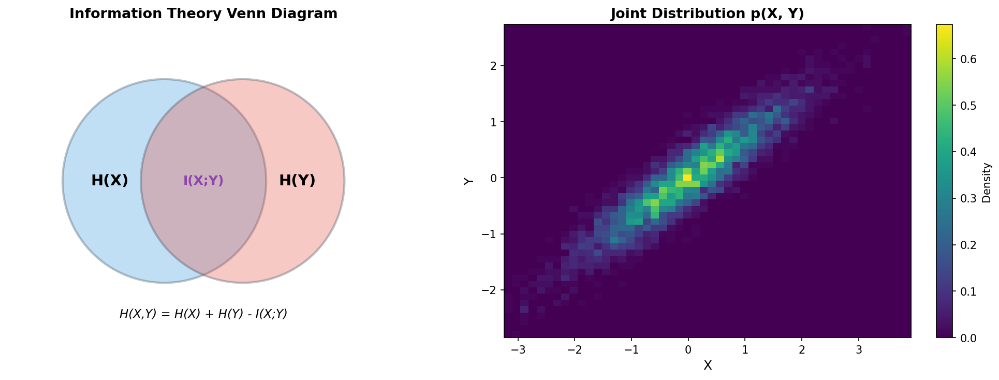
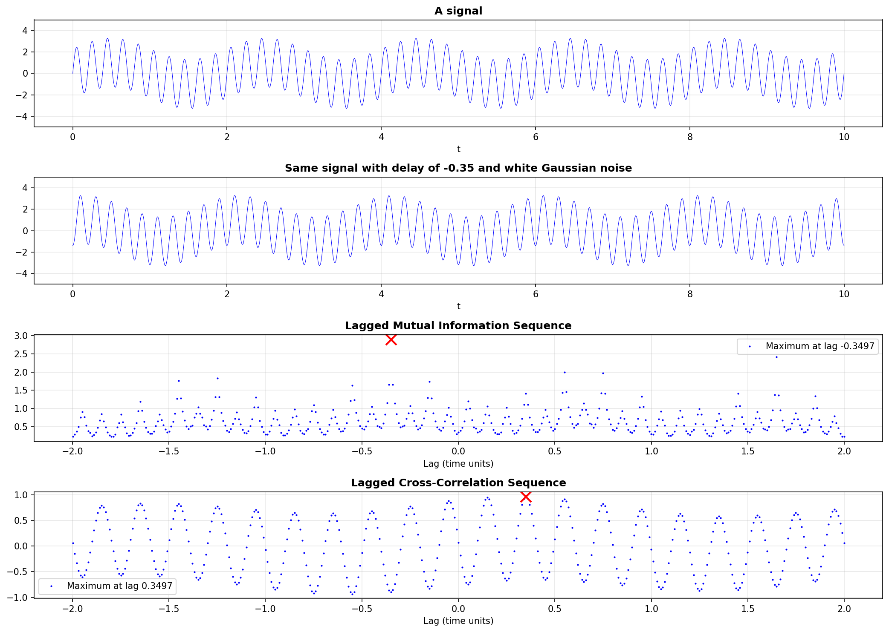

# Decision Theory

A collection of algorithms and analyses from data science, signal processing, game theory, and information theory. Each subfolder contains original implementations (MATLAB/SageMath), Python equivalents, and visualizations.

## Topics

### [Mutual Information and Joint Entropy](mutual_information_joint_entropy/)

**Information Theory / Signal Processing**

Computes the mutual information and joint entropy of two signals. Demonstrates lag detection by comparing lagged mutual information against traditional cross-correlation -- showing that information-theoretic methods can successfully recover time delays in noisy signals.

| Concept Diagram | Lag Detection Results |
|---|---|
|  |  |

Key formula: `I(X; Y) = H(X) + H(Y) - H(X, Y)`

---

### [Visual Gale-Shapley Algorithm](visual_gale_shapley/)

**Game Theory / Matching Theory**

A visual, step-by-step implementation of the Gale-Shapley stable marriage algorithm. Shows preference tables with color-coded proposals (green), rejections (red), and pending entries (blue) as the algorithm progresses day by day.

| Step-by-Step Tables | Final Matching |
|---|---|
|  |  |

Based on the classic 1962 Gale-Shapley algorithm, inspired by a [Numberphile video](https://www.youtube.com/watch?v=Qcv1IqHWAzg) with Dr. Emily Riehl.

---

## Structure

```
decision_theory/
  mutual_information_joint_entropy/
    mutual_information.m      -- MATLAB function for MI and joint entropy
    lag_test.png              -- Original MATLAB lag detection output
    lag_test_python.png       -- Python reproduction
    info_theory_concepts.png  -- Conceptual diagrams
    README.md
  visual_gale_shapley/
    stable_marriage           -- SageMath Gale-Shapley implementation
    GSV0.png - GSV8.png       -- Original SageMath step visualizations
    gale_shapley_step_*.png   -- Python reproduction of step visualizations
    gale_shapley_matching.png -- Python bipartite matching graph
    LICENSE                   -- GPL v2
    README.md
```

## Languages

- **Original code**: MATLAB (mutual information), SageMath/Python (Gale-Shapley)
- **Python equivalents**: NumPy, Matplotlib (provided for all analyses)

## Author

Keivan Hassani Monfared ([k1monfared](https://github.com/k1monfared))
