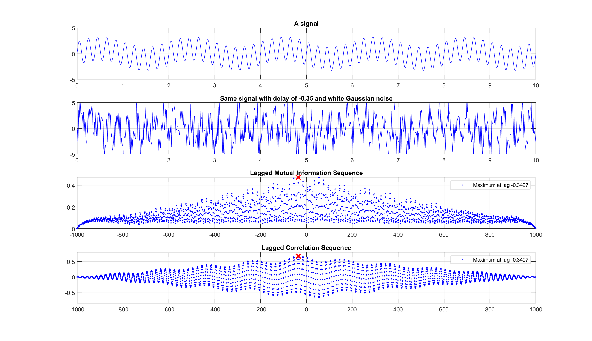

# Mutual Information and Joint Entropy

**Topic: Information Theory / Signal Processing**

Computing the mutual information and joint entropy of two signals, and using lagged mutual information to detect time delays between signals -- a technique from information theory that can outperform traditional cross-correlation when relationships are nonlinear.

## Background

**Mutual information** `I(X; Y)` measures the amount of information that one random variable contains about another. Unlike correlation, which only captures linear relationships, mutual information captures any statistical dependency between variables.

The key relationships are:

```
I(X; Y) = H(X) + H(Y) - H(X, Y)
```

where `H(X)` is the entropy of X, `H(Y)` is the entropy of Y, and `H(X, Y)` is the joint entropy.


## The Algorithm

The MATLAB function [`mutual_information.m`](mutual_information.m) computes mutual information by:

1. **Discretizing** both signals into histogram bins
2. Computing the **joint histogram** (2D frequency table)
3. Deriving the **joint probability distribution** and **marginal distributions**
4. Computing **joint entropy** and **individual entropies**
5. Returning `I(X; Y) = H(X) + H(Y) - H(X, Y)`

### MATLAB Implementation

```matlab
function [mutualInformation, jointEntropy, entropy1, entropy2] = mutual_information(X, Y, nbins)
    % Discretize signals into bins
    edgex = min(X):binlx:max(X)+binlx;
    im1 = discretize(X, edgex);

    % Compute joint histogram using accumarray
    jointHistogram = accumarray([indrow indcol], 1);
    jointProb = jointHistogram / numel(indrow);

    % Joint entropy
    jointEntropy = -sum(jointProb .* log2(jointProb));

    % Marginal entropies
    entropy1 = -sum(p1 .* log2(p1));
    entropy2 = -sum(p2 .* log2(p2));

    % Mutual information
    mutualInformation = entropy1 + entropy2 - jointEntropy;
end
```

### Python Equivalent

```python
import numpy as np

def mutual_information(X, Y, nbins=None):
    X, Y = np.asarray(X).ravel(), np.asarray(Y).ravel()
    if nbins is None:
        nbins = int(np.log2(len(X)))

    # Discretize
    edges_x = np.linspace(X.min(), X.max() + 1e-10, nbins + 1)
    im1 = np.digitize(X, edges_x) - 1
    edges_y = np.linspace(Y.min(), Y.max() + 1e-10, nbins + 1)
    im2 = np.digitize(Y, edges_y) - 1

    # Joint histogram and probability
    joint_hist = np.zeros((im1.max() + 1, im2.max() + 1))
    for i, j in zip(im1, im2):
        joint_hist[i, j] += 1
    joint_prob = joint_hist / len(X)

    # Entropies
    nz = joint_prob > 0
    joint_entropy = -np.sum(joint_prob[nz] * np.log2(joint_prob[nz]))

    h1 = joint_hist.sum(axis=1)
    p1 = h1[h1 > 0] / h1[h1 > 0].sum()
    entropy1 = -np.sum(p1 * np.log2(p1))

    h2 = joint_hist.sum(axis=0)
    p2 = h2[h2 > 0] / h2[h2 > 0].sum()
    entropy2 = -np.sum(p2 * np.log2(p2))

    return entropy1 + entropy2 - joint_entropy, joint_entropy, entropy1, entropy2
```

## Lag Detection Example

The demonstration creates two signals:
- **x(t)** = sin(pi * t) + 2.3 * sin(10 * pi * t)
- **y(t)** = x(t + 0.35) + small white Gaussian noise

Then it sweeps across different lags and compares two methods for detecting the true delay of 0.35:

1. **Lagged Mutual Information** -- computes I(x, y_lagged) for each lag
2. **Lagged Cross-Correlation** -- computes the normalized cross-correlation for each lag

Both methods successfully identify the correct lag of approximately **-0.35** time units.

### Original MATLAB Result



### Python Reproduction


Both the mutual information and cross-correlation methods correctly identify the peak near lag = 0.35 (the true delay). The mutual information approach is particularly valuable when the relationship between signals is nonlinear, where cross-correlation may fail.

## Source

Based on [StackOverflow answer #23691992](https://stackoverflow.com/a/23691992/1209885), edited by Keivan Hassani Monfared.

## Files

| File | Description |
|------|-------------|
| `mutual_information.m` | MATLAB function computing mutual information, joint entropy, and individual entropies |
| `lag_test.png` | Original MATLAB output showing lag detection comparison |
| `lag_test_python.png` | Python reproduction of the lag detection analysis |
| `info_theory_concepts.png` | Conceptual diagram: information Venn diagram and joint distribution heatmap |
