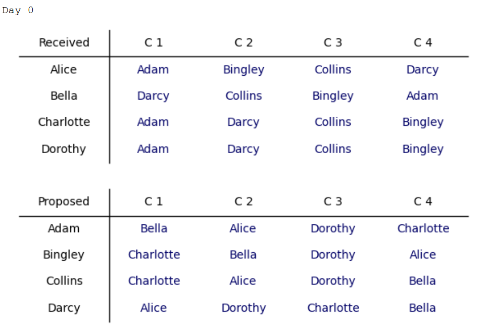
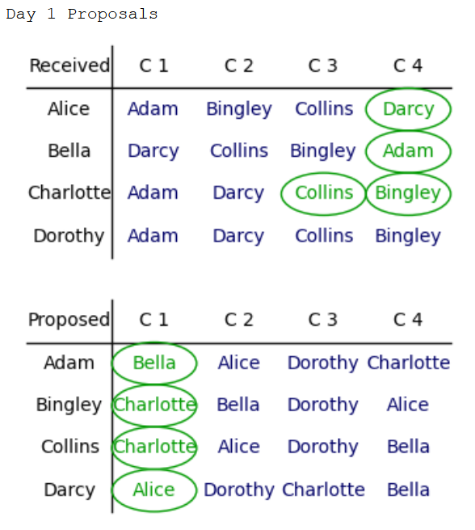
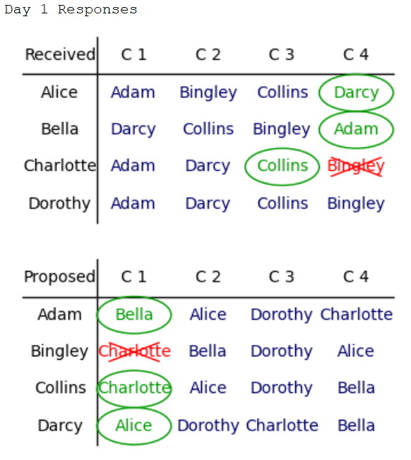
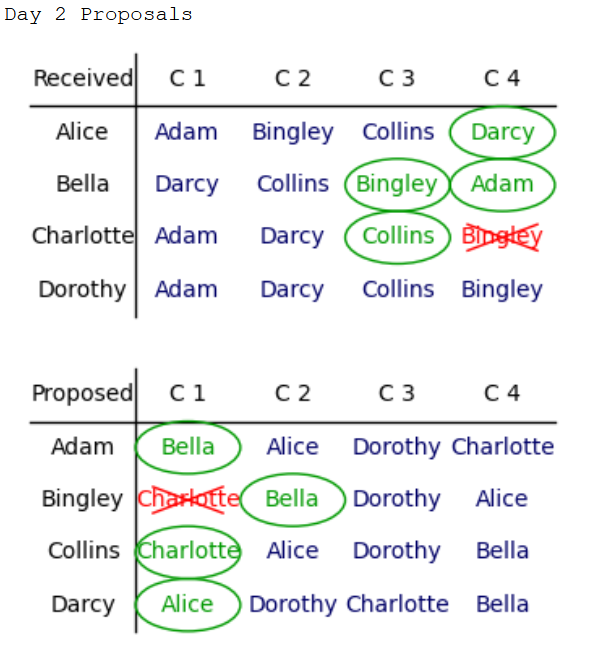
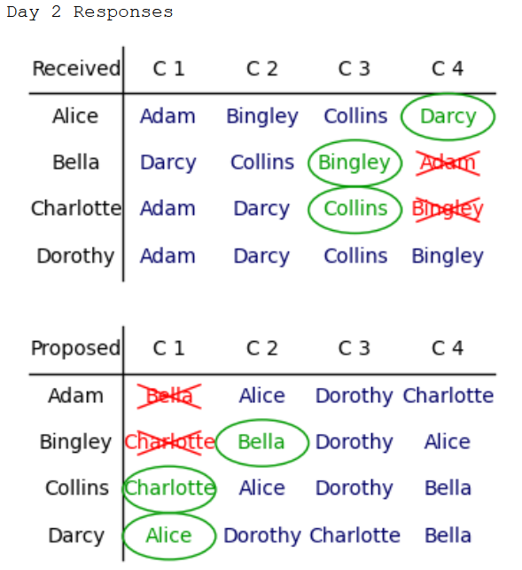
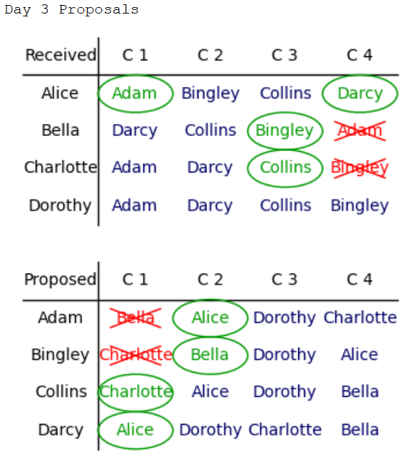
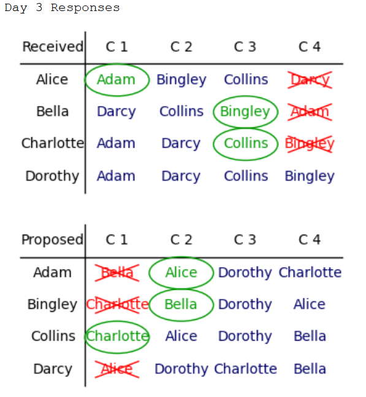
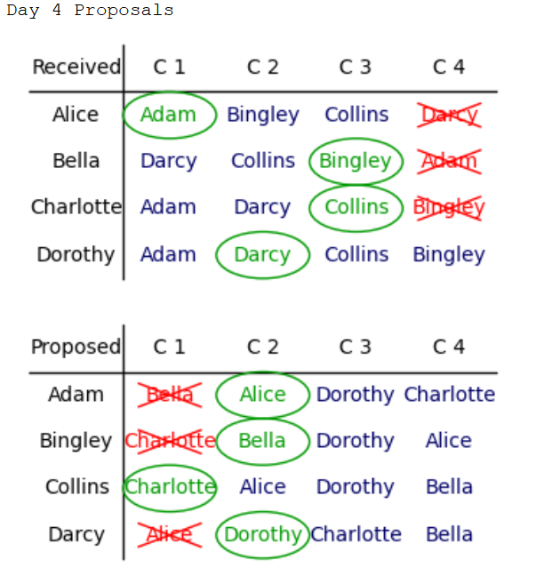
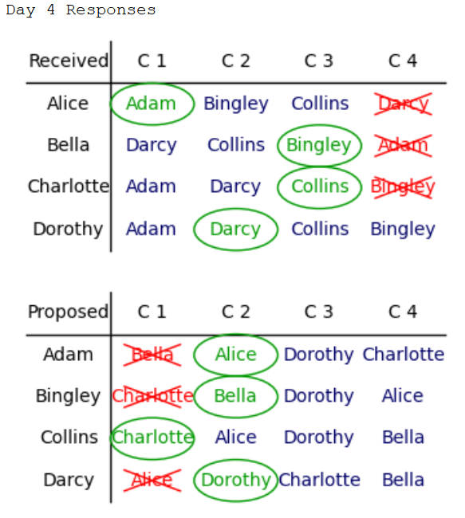

> This codes runs in SAGE.

Visualizing Gale-Shapley Algorithm

This algorithm considers a group of n girls and n boys, and initilizes a random ranking of all girls for each boy and a random ranking of all boys for each girl. 

Then the algorithm runs of a day-by-day basis:
Each day all the guys propose to the top person in their list that they are not rejected by her yet, and all the girls who are proposed to, that day, accept the guy which is ranked best in their list. This process goes on until at the end of a day all the guys are married. Then it stops.

Acording to Gale-Shapley, this is a stable matching, in the sense that for any two couples, the at least one of the four people preferes to be with their current spouse.

The algorithm can be simplified quite a bit if in each step only one guy proposes and the girl right away decides to accept or reject the proposal, but I wanted to visualize it on a day-by-day basis of all possible proposals for that day. This requires more memory, but less cycles through the whole algorithm.

In this implementation I am assuming the boys propose and the girls accept/reject, which according to Gale-Shapley results in the best possible stable marriage for each boy, and worst possible stable marriage for each girl, according to their rankings. However, if you want to switch this process, simply switch the list of boys and girls while calling the function. There's no need to change any of the code.

The motivation for this piece of code came from a video by Numberphile youtube channle (https://www.youtube.com/watch?v=Qcv1IqHWAzg) interveiwing Dr. Emily Riehl. The names of boys and girls in my small 4x4 example also come from her example. Omid Khanmohammadi sent me the video and after watching it and reading a little bit more about it I was so excited to make a similar example with those tables in it.

Here is a sample run of the code:

o On day 0 everyone makes their prefrence list:

o On day 1 proposals and responses start until everyone is matched:

 

 

 

 

To Do:
- I'd like to do a similar thing for Irving's stable roommate algorithm.
- Change colors for proposals and tentative marriages (values in the preference list could be 1 for proposal and 2 for tentative match, and then accordingly changes in the DrawTables function)
- Show in a bipartite graph way with colored (with arrows?) edges.
- Write a piece to run it for both girls and guys, then finds each persons best and worst possible match. 

> then the question is can we get everything in between in some match?

- make it to run over a Hall marriage problem That is not everyone is ranked by everyone! 
- - One possible idea is that everyone who is not ranked gets to the end of the list (randomly?)
- - or we could just run the Gale-Shapley over the incomplete ranking lists, if it runs out without a solution, that means there is no stable solution. The question would be what are necessary and sufficient conditions for a solution to exist.
- - The organ matching problem says everyone needs an organ might come with an organ that does or does not match him, but he's to give up his organ only if he finds an organ that matches him. In this case it is just a permanent-rank problem whih tells a principal submatrix of a the biadjacency matrix is has full permanent rank, what is a maximum one and how to find it! Then we can combine it with the ranked problem.
