# Visual Gale-Shapley Algorithm

**Topic: Game Theory / Matching Theory**

A visual implementation of the Gale-Shapley stable marriage algorithm, showing day-by-day proposals and acceptances with color-coded preference tables.

## Background

The **Gale-Shapley algorithm** (1962) solves the **stable matching problem**: given n boys and n girls, each with a ranked preference list of the opposite group, find a matching where no two people would prefer each other over their assigned partners (a "blocking pair").

Key properties of the algorithm:
- It always produces a **stable matching** (no blocking pairs exist)
- When boys propose, the result is **boy-optimal** (best possible stable match for every boy) and **girl-pessimal** (worst possible stable match for every girl)
- To reverse this, simply swap which side proposes

### How It Works

1. **Day 0**: Each person creates a ranked preference list
2. **Each subsequent day**:
   - **Proposals**: Every unmatched boy proposes to the highest-ranked girl on his list who hasn't rejected him yet
   - **Responses**: Each girl who receives proposals accepts the best proposer (according to her ranking), potentially dropping a previous tentative match
3. **Termination**: The algorithm ends when everyone is matched

## Implementation

The original code ([`stable_marriage`](stable_marriage)) runs in **SageMath** and produces visual preference tables where:
- **Blue** names are unaffected entries in preference lists
- **Green** circles mark current proposals / tentative matches
- **Red** X marks indicate rejections

### Python Equivalent

A standalone Python implementation using matplotlib generates equivalent visualizations. The algorithm runs with the same Pride and Prejudice characters from the [Numberphile video](https://www.youtube.com/watch?v=Qcv1IqHWAzg) featuring Dr. Emily Riehl.

## Example Walkthrough

Using characters: Boys = {Bingley, Collins, Darcy, Wickham}, Girls = {Charlotte, Elizabeth, Jane, Lydia}

### Day 0 -- Initial Preferences

Each person has a ranked preference list (C1 = first choice, C4 = last choice):

| | Original (SageMath) | Python Reproduction |
|---|---|---|
| Day 0 | 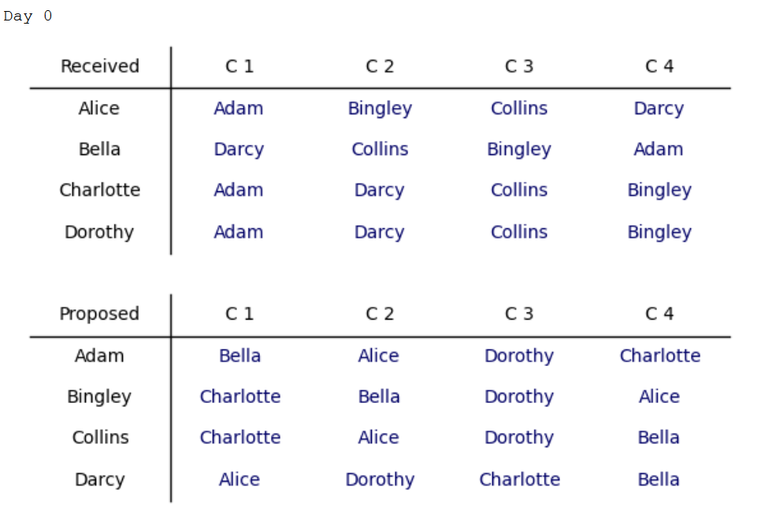 | 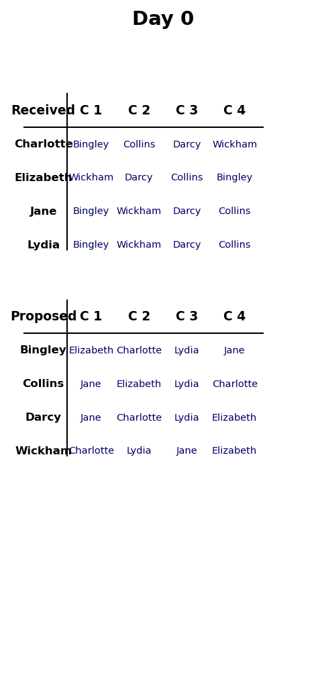 |

### Day-by-Day Proposals and Responses

| Day | Proposals | Responses |
|-----|-----------|-----------|
| 1 | 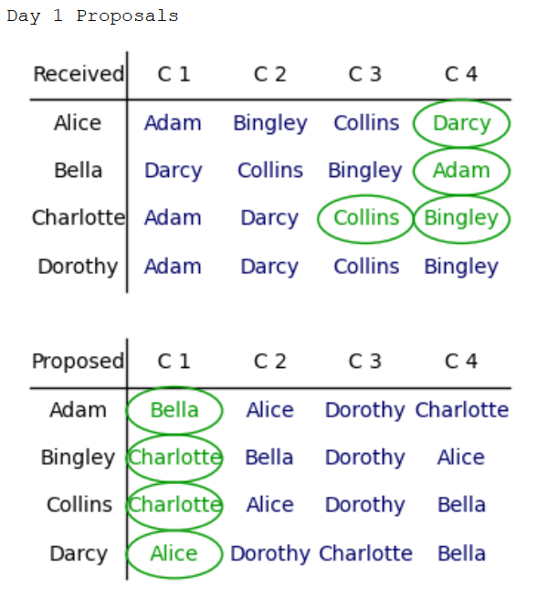 | 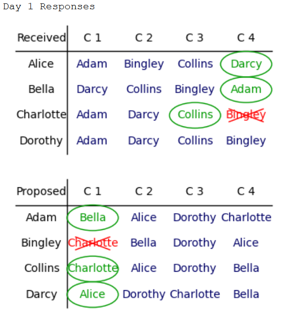 |
| 2 | 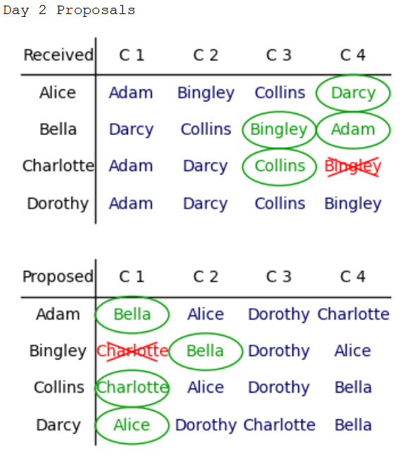 | 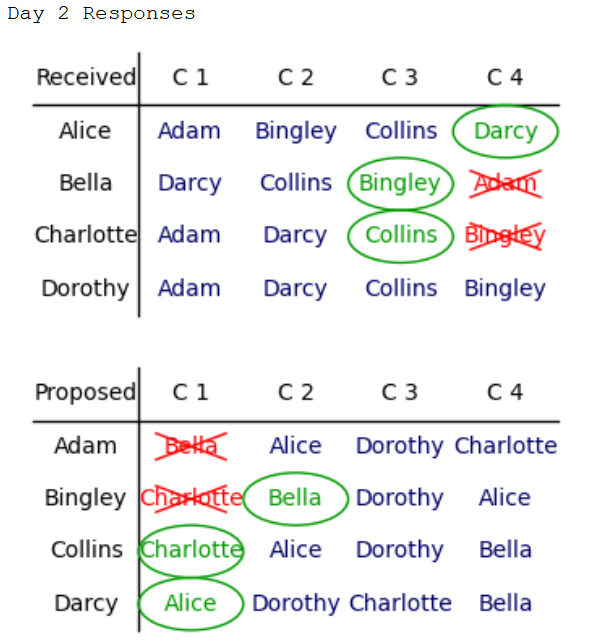 |
| 3 | 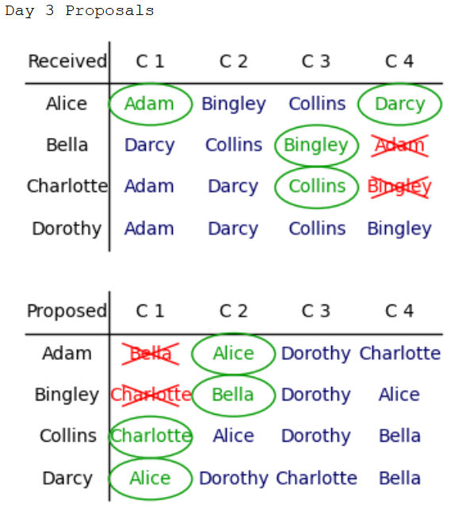 | 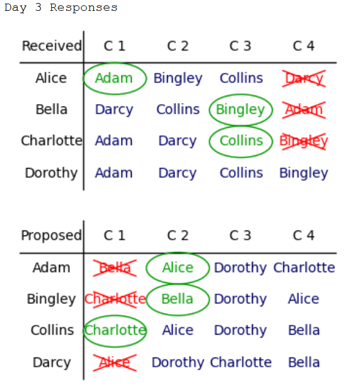 |
| 4 | 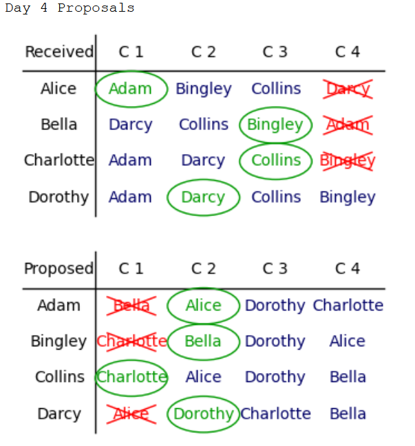 | 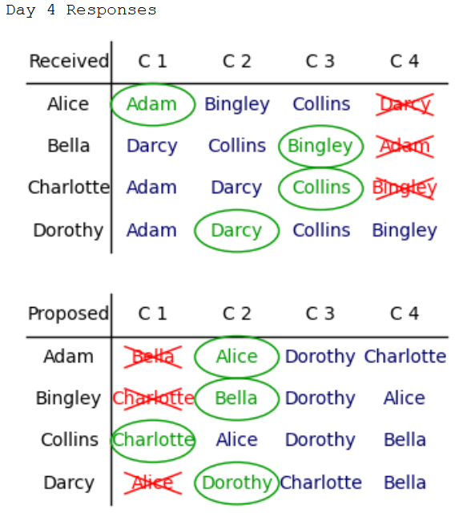 |

### Final Stable Matching (Python)

The bipartite graph shows the final boy-optimal stable matching:

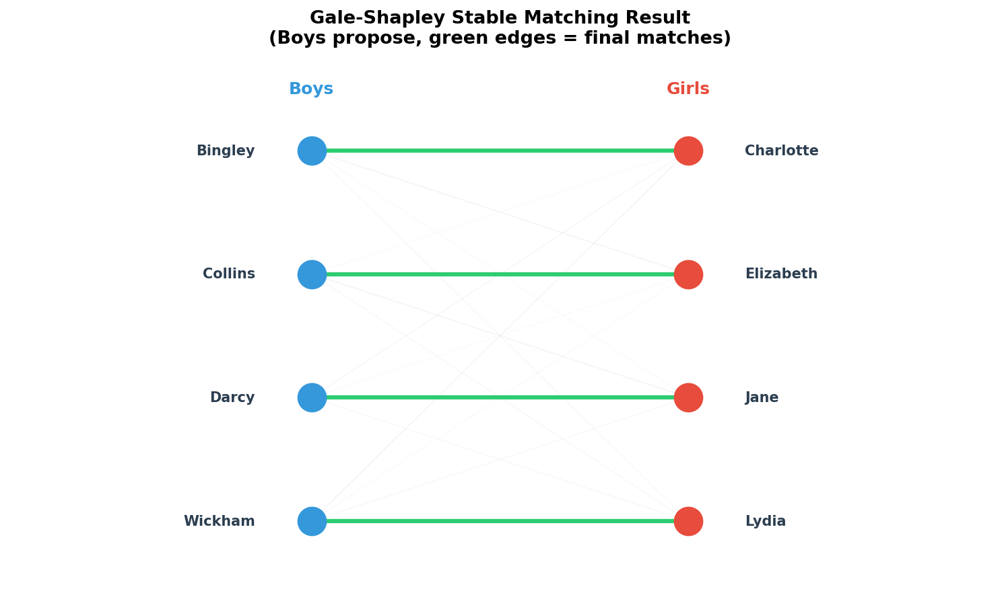

**Result**: Bingley-Charlotte, Collins-Elizabeth, Darcy-Jane, Wickham-Lydia

This is the best stable outcome for the boys (who propose) and the worst stable outcome for the girls.

## Future Directions

From the original author's notes:
- Implement Irving's stable roommate algorithm
- Enhanced color coding for proposals vs tentative marriages
- Bipartite graph visualization with directed edges
- Compare boy-proposing vs girl-proposing outcomes to find each person's best and worst stable partner
- Extend to incomplete preference lists (Hall's marriage theorem)
- Explore connections to the organ matching problem and permanent rank of biadjacency matrices

## Motivation

Inspired by a [Numberphile video](https://www.youtube.com/watch?v=Qcv1IqHWAzg) interviewing Dr. Emily Riehl. The character names come from her example (Pride and Prejudice). Code developed after Omid Khanmohammadi shared the video.

## Files

| File | Description |
|------|-------------|
| `stable_marriage` | Original SageMath implementation of the Gale-Shapley algorithm |
| `LICENSE` | GNU General Public License v2 |
| `GSV0.png` - `GSV8.png` | Original SageMath visualization outputs (Day 0 through Day 4) |
| `gale_shapley_step_*.png` | Python reproduction of the algorithm step visualizations |
| `gale_shapley_matching.png` | Python bipartite graph showing the final stable matching |
